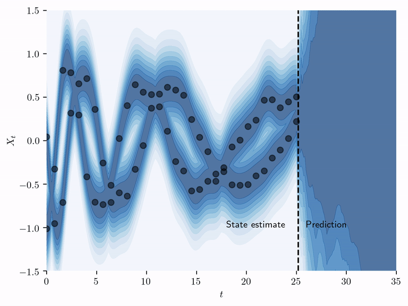

# Stochastic Variational Inference for State Estimation

Accompanying code for "State estimation of a physical system with unknown governing equations" by Kevin Course
and Prasanth B. Nair.

<p align="center">
  
</p>

## Index

1. [Installation](#1-installation)
2. [Usage](#2-usage)
3. [Building documentation](#3-building-documentation)
4. [Reference](#4-reference)

## 1. Installation

If you just want to use the package,
you can install `svise` [from PyPI](https://pypi.org/project/svise/).

If you wish to reproduce experiments / figures, we recommend
[installing optional dependencies](#installing-optional-dependencies).

### Install from PyPI

```bash
pip install svise
```

The best place to learn about the package is the [tutorials](https://github.com/coursekevin/svise/blob/tutorials/tutorials/1-intro-to-svise.ipynb)
or the 
[documentation](http://svise.readthedocs.io/)

### Installing Optional Dependencies

We use [conda-lock](https://github.com/conda/conda-lock)
and [poetry](https://python-poetry.org/) to
manage dependencies (although we wouldn't recommend it...).

After installing conda-lock, follow the steps below to install all dependencies
used in the experiment environment.

1. Clone the repository.

```bash
git clone https://github.com/coursekevin/svise.git
```

2. Navigate into the directory and create a new conda environment.

```bash
conda-lock install --name svi-state-estimation conda-lock.yml
```

3. Activate the environment that was just created.

```bash
conda activate svi-state-estimation
```

4. Install the remaining dependencies.

```bash
poetry install --with dev
```

5. Run tests to confirm everything was install correctly. (Some tests are stochastic so might fail on some attempts.
   If any tests fail, run again before filing an issue.)

```bash
pytest tests/
```

**Dependencies:**

- see `pyproject.toml` for a complete list of dependencies.

6. Download pretrained models, data, and figures:

```bash
repopacker download svise-pack.zip
repopacker unpack svise-pack.zip
```

This will download everything and place it into the correct directories
except for the cylinder data used in the third
example. The cylinder data is split up in seven 3.2GB chunks. Download all the
chunks from [Zenodo](https://zenodo.org/records/8327545) and combine the data with:

```bash
cat cylinder_data_split.z*[0..9]* cylinder_data_split.zip > cylinder_data.zip
```

Unzip the data move the file `vortex.pkl` into the directory

```bash
/experiments/3_cylinder_flow/data
```

---

## 2. Usage

### Using the package

See the 
[tutorials](https://github.com/coursekevin/svise/blob/tutorials/tutorials/1-intro-to-svise.ipynb)
or the 
[documentation](http://svise.readthedocs.io/).


### Running numerical studies

The numerical studies can be rerun from the `experiments` directory using
the command-line script `main.py`. All numerical studies follow the
same basic structure: (i) generate datasets, (ii) train models / run
methods, and (iii) post process for figures and tables.

1. Generate dataset for a specific experiment. The newly generated
   dataset can be found in the experiment subdirectory.

```bash
python main.py [experiment] generate-data
```

- Experiments in main text:

  - `pure-se` (state estimation without corruptions)
  - `corrupted-se` (state estimation without probabilistic corruptions)
  - `cylinder-flow` (Cylinder-flow reduced-order modeling experiment)

- Examples in Methods:

  - `symb-goveq-disc` (discovering governing equation experiments)
  - `second-order-disc` (second order governing equation discovery)
  - `ext-goveq-disc` (Lorenz '96 experiment)
  - `binary-black-hole` (Binary black hole problem)

2. Train a model on a dataset optionally specifying the random seed.
   The model will be saved in the experiment subdirectory. If there is only
   one dataset (such as is true for the cylinder-flow problem) there is no
   need to specify the dataset path.

```bash
python main.py [experiment] run-[method] -dp path/to/dataset.pt -rs seed
```

- Methods:
  - `svise` (stochastic variational inference for state estimation)
  - `pf` (particle filter)
  - `sindy` (SINDy with STLSQ + SINDy with SR3)

3. Post process results for figures and tables. Any figures or tables
   can be found in the experiment subdirectory. This script expects
   there to be one model / dataset. Undefined behavior may occur if
   this is not the case.

```bash
python main.py [experiment] post-process
```

## 3. Building documentation

Building documentation requires [Sphinx](https://www.sphinx-doc.org/en/master/)
and the [Read the Docs Sphinx Theme](https://github.com/readthedocs/sphinx_rtd_theme).
First navigate into the `docs` directory.

Building html docs:

```bash
make html
```

Building pdf docs:

```bash
make latexpdf
```

Completed docs can be found in the `docs/_build` directory.

## 4. Reference

Course, K., Nair, P.B. State estimation of a physical system with unknown governing equations. Nature 622, 261–267 (2023). https://doi.org/10.1038/s41586-023-06574-8 
